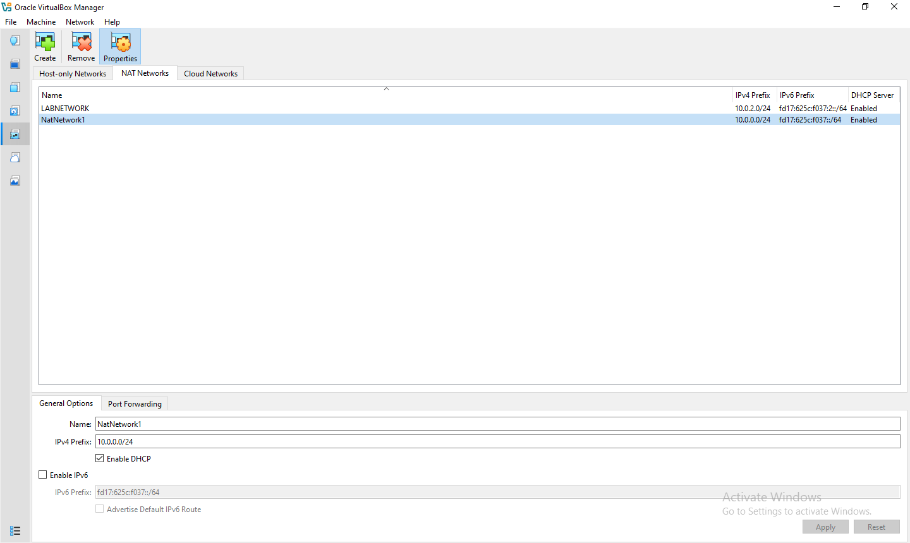
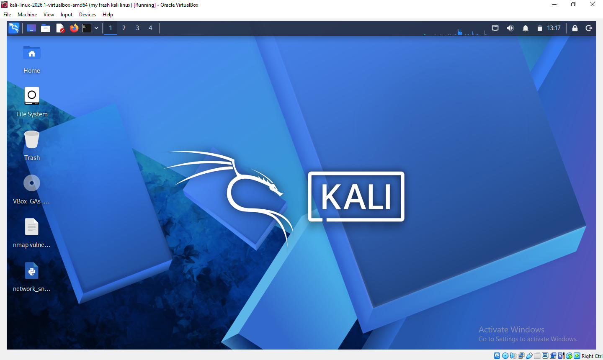

# 🔐 Cybersecurity Lab Environment Setup

### Building an isolated virtual lab for penetration testing and ethical hacking practice

 
  
  

---

## 📌 Project Overview

This project documents the process of building a **virtual cybersecurity and penetration-testing laboratory** using VirtualBox and Kali Linux. It was created as a hands-on, self-guided way to develop practical security skills — from environment setup through active testing — entirely within an isolated network that carries no risk to live systems.

---

## 🎯 Objectives

- Build a fully isolated virtual lab, separate from any production or home network
- Gain hands-on experience installing and configuring Kali Linux
- Practice core penetration-testing workflows: scanning, enumeration, exploitation
- Understand how to safely stand up intentionally vulnerable target machines
- Strengthen networking fundamentals (subnetting, static IP assignment, NAT networking)
- Document the process clearly enough that it can be rebuilt or shared with others

---

## 🎯 Purpose of the Lab

The purpose of this lab is to create a **controlled, legal, and repeatable environment** for practicing cybersecurity skills. Real-world testing against systems you don't own is illegal — this lab solves that by giving me:

- A safe space to run scanning and exploitation tools without any real-world consequence
- Vulnerable-by-design target machines to practice against
- A repeatable setup I can snapshot, reset, and rebuild as my skills grow
- A foundation for further certifications and hands-on cybersecurity learning

---

## 🏗️ Lab Architecture

```
Host Machine
 └── VirtualBox
      ├── Kali Linux (Attacker) — 10.0.0.10
      ├── Target VM 1           — 10.0.0.20
      └── Target VM 2           — 10.0.0.30
      Network: NAT Network (10.0.0.0/24)
```

The lab runs entirely inside VirtualBox on a single host machine. All virtual machines connect through a **VirtualBox NAT Network**, which lets the VMs communicate with each other and reach the internet (for updates and tool installation) while staying isolated from the host machine's local network.

---

## ⚙️ Lab Configuration

| Component | Setting |
|---|---|
| 🖥️ Host OS | [Windows 10] |
| 💾 Host RAM | [16 GB] |
| ⚙️ Processor | [Intel Core i7] |
| 🧩 Hypervisor | VirtualBox v7.2 |
| 🛡️ Security OS | Kali Linux v2026.1 |
| 💽 Kali RAM | [2048 MB] |
| 🌐 Virtual Network | NAT Network |
| 📡 Network Address | 10.0.0.0/24 |
| 🖧 Kali IP Address | 10.0.0.0.2/24 |
| 🚪 Default Gateway | 10.0.0.1 |
| 🔎 DNS Server | 8.8.8.8 |
| 🧭 Future VM Range | 10.0.0.20 – 10.0.0.30 |

---

## 🛠️ Lab Setup Procedure

1. **Install WinRAR x64-7.20**
   Installed WinRAR x64-7.20 and used it to extract the downloaded Kali Linux archive, since the Kali Linux download comes as a compressed file that needs to be unpacked before it can be imported into VirtualBox.

2. **Install VirtualBox v7.2**
   Download VirtualBox v7.2 from the official Oracle site and run through the installer using the default settings. This provides the hypervisor that will host all virtual machines in the lab.

3. **Create a NAT Network**
   In VirtualBox, go to **File → Tools → Network Manager** and create a new **NAT Network** with the subnet `10.0.0.0/24`. A NAT Network allows all VMs attached to it to communicate with each other and reach the internet, while keeping the lab isolated from the host's own network.
   
   


4. **Import Kali Linux**
   The Kali Linux virtual machine was downloaded from the official Kali Linux website and imported into VirtualBox.

   The VM network adapter was configured as follows:
   - Adapter 1
   - Attached to: NAT Network
   - Network:     NatNetwork
   - Adapter Type: Intel PRO/1000 MT Desktop

   The VM was allocated:
   - RAM: 2048 MB
     
      

5. **Configure the Kali Linux Network**
   Open the Kali Linux VM's **Settings → Network**, set the adapter to **NAT Network**, and select the `NAT Network' created in step 3. Boot the VM and assign it a static IP (`10.0.0.10`) within the `10.0.0.0/24` subnet so it has a consistent address every time the lab is used.

  
  
6. **Create a Clean VM Snapshot**
   Once Kali Linux is installed, configured, and confirmed working, a **snapshot** of the VM (**Machine → Take Snapshot**) was taken. This preserves a clean, known-good baseline that the lab can always be reverted to before or after testing.

---

## ✅ Lab Verification
Test	Command	Expected Result
Check IP Address	ip a show	Output shows the Kali VM's static IP correctly set to 10.0.0.10
Test Gateway	ping 10.0.0.1	Replies received from the default gateway, confirming the route out of the subnet is reachable
Test Internet Connectivity	ping google.com	Successful replies, confirming the Kali VM can reach the internet through the NAT Network
Test DNS Resolution	nslookup google.com	Returns a valid IP address for the domain, confirming DNS is resolving correctly
Verify Nmap	nmap 10.0.0.0/24	Target VM(s) appear as "up" and reachable on the subnet
Verify Snapshot	Machine → Restore Snapshot	VM reverts cleanly to the saved baseline state with no configuration lost

---

## 📚 What I Learned

- **Virtual networking concepts** — I learned the difference between NAT, NAT Network, Bridged, and Host-Only adapters in VirtualBox, and why a NAT Network was the right choice here: it lets my VMs talk to each other and reach the internet for updates, without exposing them to my home network.
- **Installing and configuring Kali Linux** — I learned how to import a pre-built OVA appliance, boot it for the first time, and get it into a usable state as a dedicated attack machine.
- **IP addressing and subnetting** — I practiced assigning static IPs within a `/24` subnet and understood why consistent addressing matters for a lab you'll reuse repeatedly.
- **Snapshots as a safety net** — I learned that snapshots aren't just a convenience; they're what makes it safe to experiment, since I can always roll back to a known-good state if something breaks.
- **Working with archive tools** — I learned how compressed OS images are packaged and how to properly extract them with WinRAR before importing into a hypervisor.
- **Documentation as a skill** — Writing this README taught me that clearly documenting a technical setup (architecture, configuration, steps, verification) is its own skill, separate from doing the technical work itself.

---

## 🔒 Security and Ethical Use

- This lab exists specifically so that testing happens **only** against machines I own or have explicit authorization to test.
- All target machines are intentionally vulnerable systems built for learning, never real production systems.
- The lab network is kept separate from my host machine's real network to prevent any accidental impact outside the lab.
- Snapshots are used before and after testing so the environment can always be reset to a clean, known state.
- The skills practiced here — scanning, enumeration, exploitation — are only legal and ethical when used with proper authorization; using them against systems you don't own or lack permission to test is illegal.

---

## 🧰 Tools and Resources

| Tool | Resource Link |
|---|---|
| VirtualBox v7.2 | https://www.virtualbox.org/ |
| Kali Linux v2026.2 | https://www.kali.org/ |
| WinRAR x64-7.20 | https://www.win-rar.com/ |

---

## ⚠️ Disclaimer

This lab is for **educational purposes only**, built entirely within an isolated virtual environment. All testing is performed against systems I own or have explicit permission to test. Do not use these techniques against systems you do not own or lack authorization to test.

---

## 👤 Author

**Ekpenyong Peace**
Cybersecurity Professional B083C 

🔗 LinkedIn:
https://www.linkedin.com/in/peace-ekpenyong-28a225153

---

## 🗂️ Project Information

Program Name: Cybersecurity at NetworkWalks 
Week: 01 |Project: Cybersecurity and Pentesting Lab Setup | Repository: GitHub 
